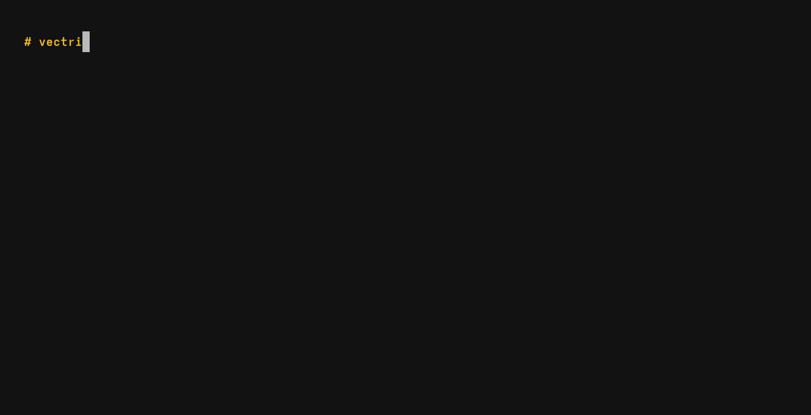

<p align="center">
  <picture>
    <source media="(prefers-color-scheme: dark)" srcset="assets/logo-dark.svg">
    
  </picture>
</p>

<p align="center">
  <a href="https://crates.io/crates/vectrize"></a>
  <a href="https://github.com/pablofrr/vectrize/releases/latest"></a>
  
  <a href="https://vectrize.com"></a>
</p>

Local semantic search over folders of Markdown documents, built for you and your AI agents.
Everything runs on your machine, on any laptop CPU: no GPU, no API keys.

- **Hybrid search**: embeddings ([bge-m3](https://huggingface.co/BAAI/bge-m3), multilingual) + BM25, fused with RRF. Finds paraphrases, not just matching words, in any language.
- **Makes your agent faster**: Up to 10 seconds faster per question to your agent than grep.
- **Always up to date**: a small daemon watches your folders and reindexes on save (~0.5 s), re-embedding only what changed.
- **Fast**: ~20–30 ms per search once the daemon is running.



## Install

```sh
curl -LsSf https://vectrize.com/install | sh
# or
brew install pablofrr/tap/vectrize
# or, from crates.io (Rust 1.89+)
cargo install vectrize
```

macOS (Apple Silicon) and Linux (x86_64, arm64) with glibc 2.39+: Ubuntu 24.04, Debian 13, Fedora 40 or newer.
On Windows, use WSL2 with your notes inside WSL (changes to files under `/mnt/c` are not picked up live).

The first run downloads the embedding model (~560 MB) from Hugging Face.

## Usage

```sh
vectrize setup ~/notes                 # index a folder, start the daemon with your session
vectrize add ~/work/project/docs       # add more folders
vectrize search "how do we deploy the backend"
vectrize search "ERR_TIMEOUT" --mode bm25       # exact identifiers
vectrize search "auth flow" --in ~/notes        # a single folder
vectrize status                        # folders, index and daemon state
```

```text
notes/Deploy.md:12  Backend > Production
  The backend is deployed with a blue/green switch on the load balancer…
```

`setup` is optional: without it, the first search starts the daemon.

Other commands: `remove <folder>`, `stop`, `watch` (the daemon itself). See `vectrize --help`.

## For agents

Install the [skill](skills/vectrize/SKILL.md) so your agent searches your notes on its own (Claude Code, Codex,
Cursor, Copilot, Gemini CLI and any other agent that supports [Agent Skills](https://agentskills.io)):

```sh
npx skills add pablofrr/vectrize
```

Without Node, copy [`skills/vectrize`](skills/vectrize) into your agent's skills folder (e.g. `~/.claude/skills/`).
No MCP server, nothing to configure. Any other agent can call `vectrize search "question" --json` directly.

Without it, the agent greps for words from your question, reads files, and greps again when the words don't match.
With vectrize, one search usually lands on the right section, so it reads one file and answers. In our test:

- **Faster**: Claude Code answered 30% faster (15.9 s instead of 22.8 s, median) with 14% fewer tokens.
- **More reliable**: it found the right note in 20 of 20 runs, against 15 of 20 with grep alone (tbf i was surprised with this one, but for vague questions, it makes a difference).

| question | grep | vectrize |
|---|---|---|
| what's most relevant in the OWASP audit we did? | 19.8 s | 20.5 s |
| what's new in the Android app? | 13.1 s | 11.5 s |
| what are our worst Android bugs? | 31.0 s | 17.9 s |
| what did I think of the vendor's offering? | 32.7 s | 15.6 s |
| **all (median)** | **22.8 s · 101k tokens** | **15.9 s · 87k tokens** |

<sub>Claude Code, headless, same permissions in both setups. 4 questions about a real 33-note wiki, 5 runs each in
alternating order; median time per answer. When a keyword is in the file name ("OWASP"), grep is just as fast.</sub>

## How it works

- Markdown is split with [text-splitter](https://github.com/benbrandt/text-splitter) (≤256 tokens per chunk), keeping
  the heading path of each chunk as context. `.gitignore` and hidden files are respected.
- One SQLite file holds everything: [sqlite-vec](https://github.com/asg017/sqlite-vec) for vectors, FTS5 for BM25.
- The daemon keeps the model in memory (~1.1 GB, so be careful with lower end devices) and unloads it after 30 min idle (~40 MB); the next search reloads it
  (~1.3 s).

